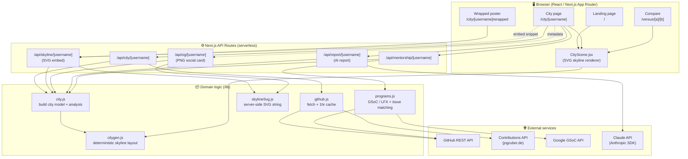

# 🌃 Commit City

**Live Deployment:** [https://commit-city-ten.vercel.app](https://commit-city-ten.vercel.app)

**Your GitHub profile, rendered as the New York City skyline at night.**

Enter any GitHub username and Commit City builds a personal metropolis where **every public repository becomes a tower** — height from stars, windows lit by how recently you've pushed, and your top projects crowned as glowing landmark skyscrapers, all reflected in the river below.

It's a contribution visualizer with a soul: part data-viz, part illustration, part on-ramp into open source.

---

## ✨ Features

### The skyline
- **One tower per repository** — height scales with stars, windows light up by recent push activity
- **Landmark towers** — your three most-starred repos become skyscrapers with colored spire lights
- **Language districts** — each tower's windows are tinted by its language
- **Fork suburbs** — forked repos appear as low-rises at the city's edge
- **Living scene** — a ferry crosses the river, a plane blinks across the sky, a shooting star streaks by; the whole skyline mirrors in the water
- **City moods** — fireworks over downtown during a hot streak, fog rolling in during quiet months

### Analysis & storytelling
- **Time machine** — a slider that replays how your city grew, year by year
- **Tower spotlight** — click any tower for its repo details (stars, forks, language, founding year, last push)
- **Night grid** — your 52-week contribution heatmap as glowing city blocks
- **City rhythm** — narrative insights ("Fridays are when this city works hardest…")
- **City records** — longest streak, busiest day, momentum, and more
- **Growth chart** — contributions per year across your whole GitHub life
- **AI City Inspector's report** — an optional Claude-written noir walking tour of your skyline

### 🚀 Break into open source
- **Program matching** — matches your tech stack to **live GSoC organizations** (from Google's API), plus curated **LFX Mentorship** and **Outreachy** rosters, with competition signals (🔥 competitive vs 🌱 friendlier odds)
- **Real starter issues** — surfaces open, unassigned `good first issue`s in your top languages, with direct repo + issue links you can try tonight
- **🌉 Bridges to target orgs** — watchlist the orgs you're aiming for; every merged PR you land there adds a girder to an illustrated bridge (mentors pick applicants who contributed early — this gamifies exactly that)
- **🎯 Application readiness score** — a 0–100 score across the signals mentors actually check (merged external PRs, recent activity, consistency, profile completeness), each with concrete advice

### 🧭 Mentorship HQ (`/prepare`) — for GSoC / LFX / Outreachy applicants
- **Season countdowns** with live "OPEN NOW" detection for application windows
- **📅 Add-to-calendar** — download all program deadlines as an `.ics` file
- **Eligibility quiz** — four questions → which of the three programs you qualify for (including Outreachy's full-time and underrepresentation criteria)
- **Program comparison** — GSoC vs LFX vs Outreachy: eligibility, commitment, stipends, cadence, contribution expectations
- **Stipend table** — what each program actually pays, including GSoC's country tiers
- **Week-by-week plan** — generated backward from the next application deadline
- **🎓 AI Proposal Coach** — get a tailored proposal outline from a project idea, or an org-mentor-style review of your draft (Claude-powered)

### 🌉 Squad street (`/squad`)
- A shared page for up to four friends targeting the same program — everyone's skyline, stats, and merged-PR progress toward a common target org. Accountability, not ranking.

### Share & embed
- **Live README embed** — `` stays live as your city grows
- **OG social cards** — shared links render the actual skyline as a preview image
- **Wrapped poster** — a downloadable year-in-review card
- **Compare mode** — two skylines facing each other across the river, with a stats face-off
- **Featured gallery** on the landing page, plus PWA install support

---

## 🏗️ Architecture



**Flow in a sentence:** the browser hits an API route → the route pulls GitHub data (cached) → `city.js` turns it into a city model → `citygen.js` lays out the towers deterministically (same username → same city) → the client renders it as SVG (or the server renders it as an SVG/PNG for embeds).

---

## 🛠️ Tech stack

| Layer | Technology |
|---|---|
| **Framework** | [Next.js 15](https://nextjs.org/) (App Router, React Server + Client Components) |
| **UI** | [React 19](https://react.dev/), plain CSS (no framework), Google Fonts (Outfit) |
| **Graphics** | Hand-authored **SVG** — rendered client-side (React) and server-side (string builder) |
| **Social images** | `next/og` (`ImageResponse`) for PNG preview cards |
| **AI** | [Claude API](https://www.anthropic.com/) via `@anthropic-ai/sdk` (`claude-opus-4-8`) |
| **Data sources** | GitHub REST API · public contributions API · Google GSoC API |
| **Caching** | In-memory TTL cache (1 hr per user, 24 hr for program lists) |
| **PWA** | Web manifest + SVG favicon |
| **Language** | JavaScript (ES modules) |

No database — everything is derived live from public APIs and cached in memory.

---

## 🚀 Getting started

```bash
# install
npm install

# run the dev server
npm run dev
```

Then open **http://localhost:3000** and enter a GitHub username.

### Environment variables (optional)

Create a `.env.local` file:

```bash
# Raises GitHub rate limits from 60/hr to 5,000/hr (recommended).
# A classic token with NO scopes is enough for public data.
GITHUB_TOKEN=ghp_xxx

# Enables the AI "City Inspector's report". Without it, the app
# works fully — that one panel just shows an "off duty" note.
ANTHROPIC_API_KEY=sk-ant-xxx
```

> **Tip:** the mentorship feature uses GitHub's issue-search API, which has the tightest rate limit. Adding `GITHUB_TOKEN` is the single most useful thing you can do for a smooth experience.

---

## 📁 Project structure

```
app/
├── page.js                     # Landing page (skyline backdrop + featured cities)
├── layout.js                   # Root layout, fonts, PWA manifest
├── globals.css                 # All styling
├── city/[username]/
│   ├── page.js                 # Main city page (all analysis panels)
│   ├── layout.js               # OG / social metadata
│   └── wrapped/page.js         # Year-in-review poster
├── versus/[a]/[b]/page.js      # Compare mode
├── prepare/page.js             # Mentorship HQ (countdowns, quiz, coach)
├── squad/page.js               # Squad street (group accountability)
└── api/
    ├── city/[username]/        # City model as JSON
    ├── skyline/[username]/     # Live SVG embed
    ├── og/[username]/          # PNG social preview
    ├── report/[username]/      # AI inspector report
    ├── mentorship/[username]/  # GSoC / LFX / Outreachy + issue matching
    ├── bridges/[username]/     # PRs merged into target orgs
    ├── readiness/[username]/   # Application readiness score
    └── coach/                  # AI proposal outline & review

components/
└── CityScene.jsx               # The SVG skyline renderer

lib/
├── github.js                   # GitHub fetching + in-memory cache
├── city.js                     # City model + analysis
├── citygen.js                  # Deterministic skyline generation
├── mentorshipData.js           # Program calendars, comparison, plan + .ics
├── skylineSvg.js               # Server-side SVG renderer (embeds/OG)
└── programs.js                 # GSoC/LFX + starter-issue matching

public/
├── icon.svg                    # Favicon
└── manifest.json               # PWA manifest
```

---

## 📌 How the mapping works

| GitHub reality | City metaphor |
|---|---|
| A public repository | A tower |
| Stars on a repo | Tower height |
| Recent pushes | Lit windows |
| Top 3 starred repos | Landmark skyscrapers with spire lights |
| Primary language | Window tint (a "district") |
| Forked repos | Low-rise suburbs |
| Contribution streak | The city's mood (fireworks vs. fog) |
| Your tech stack | Matched GSoC / LFX programs + starter issues |

---

## 🧭 Roadmap ideas

- Skyline themes (Dawn, Blade Runner, Winter)
- "Bridges" to repos you've contributed to elsewhere
- A good-first-issue lighthouse in the harbor
- GitHub OAuth for private-repo towers
- Organization cities (`/org/<name>`)

---

*Built with Next.js and the Claude API. Every project raises a tower — stars raise it higher.*
